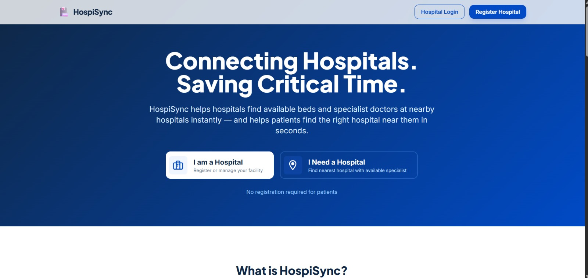
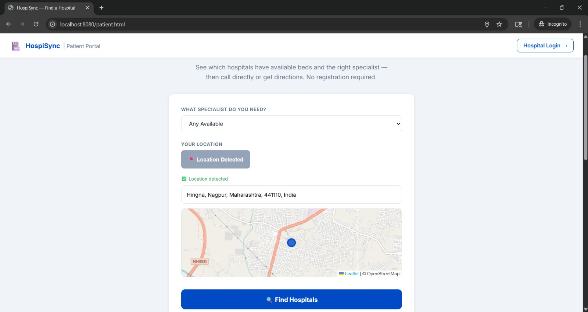
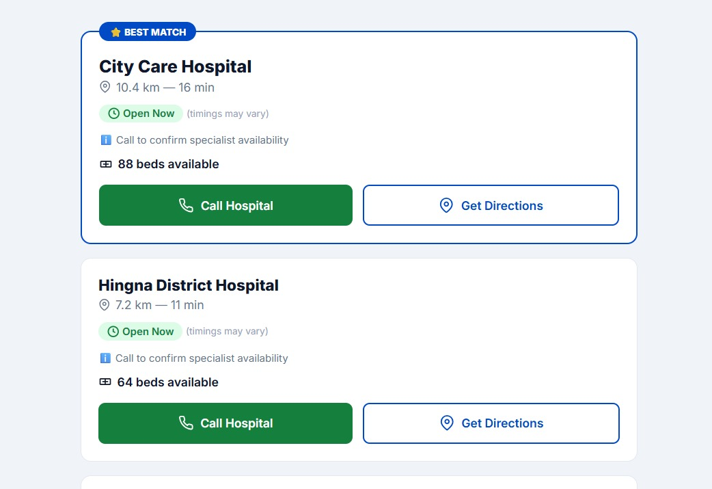
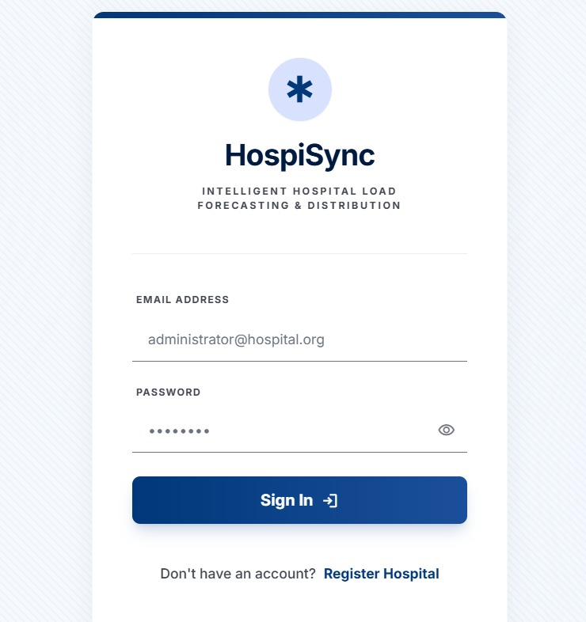
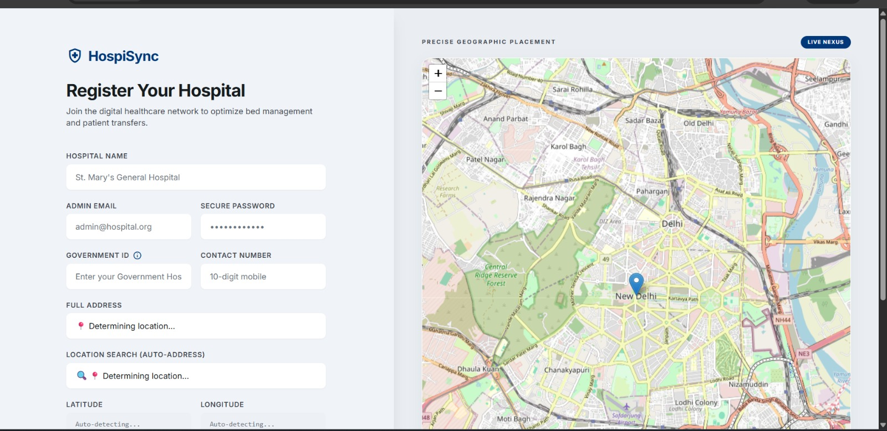
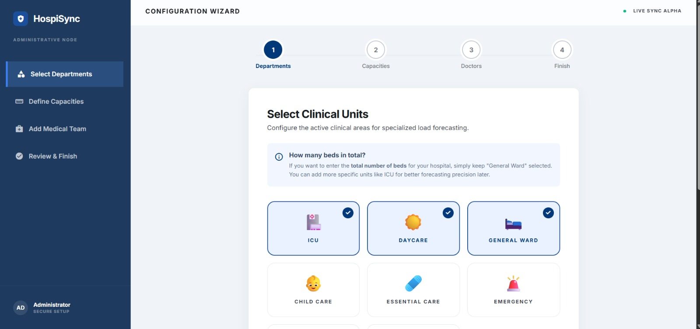
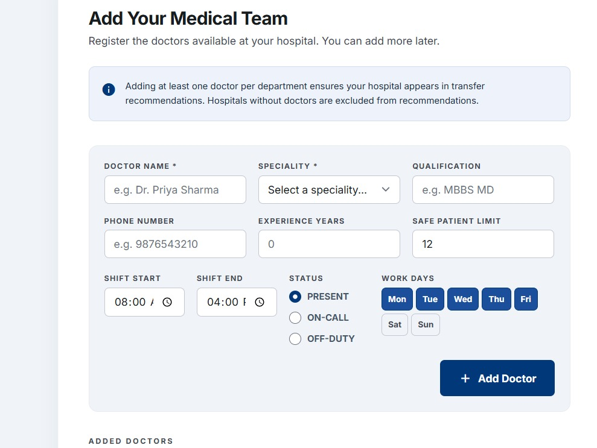
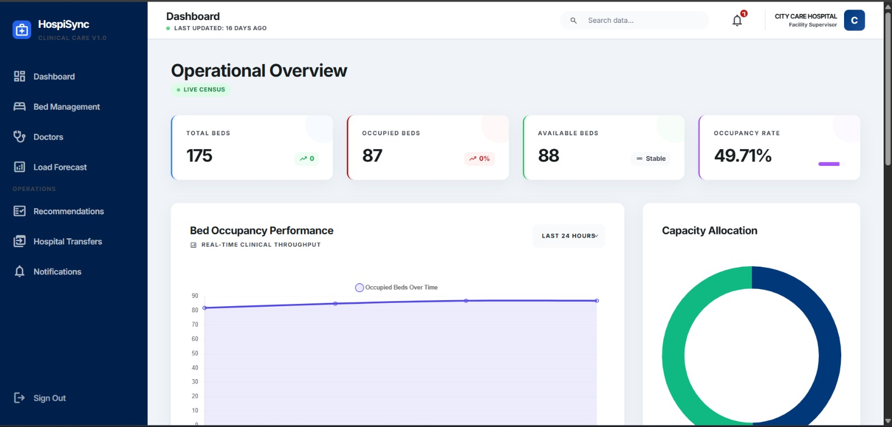
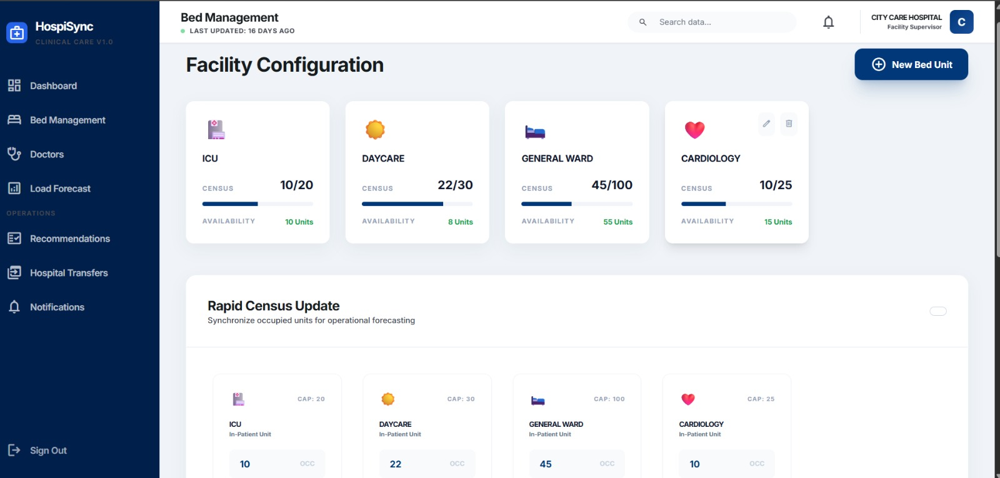

# HospiSync — Hospital Synchronization & Management System


> ✅ **Build Verified:** Last verified build: `BUILD SUCCESS` in 6:12 min — ShiftScheduler updated 9 doctors successfully (May 2026)

HospiSync is a comprehensive backend REST API designed specifically for hospital data management. It provides secure endpoints for appointment scheduling, patient tracking, and inter-hospital data synchronization through a Spring Boot architecture.

---

## 🚀 Features

*   **Role-Based Access Control:** Secure user authentication using JWT for Doctors, Patients, and Admins.
*   **Appointment Management:** Endpoints to create, update, and retrieve patient appointments.
*   **Data Synchronization:** REST APIs handling incoming and outgoing patient data patches.
*   **Department & Bed Tracking:** APIs for fetching hospital departments and managing bed category availability.
*   **Notification System:** Internal notification management for users and staff.

---

## 🛠 Tech Stack

| Category | Technology |
| :--- | :--- |
| **Backend Framework** | Java Spring Boot (Spring MVC, Data JPA, Security) |
| **Build Tool** | Maven Wrapper (`mvnw`) |
| **Database** | MySQL (Hibernate ORM) |
| **Containerization** | Docker |
| **Authentication** | JSON Web Tokens (JWT) |

---

## 🏗 Architecture

HospiSync utilizes a standard layered Spring Boot architecture:
*   **Controllers (`/controller`):** Exposes RESTful endpoints.
*   **Services (`/service`):** Contains core business logic and system operations.
*   **Repositories (`/repository`):** Handles data persistence via Spring Data JPA.
*   **Models & DTOs (`/model`, `/dto`):** Defines data structures and payload contracts.
*   **Security (`/security`):** Manages JWT-based authentication and CORS configurations.

---

## ⚙️ Getting Started

### Prerequisites

*   **Java 21** or higher
*   **MySQL** running locally or accessible remotely
*   **Docker** (optional, for containerized deployments)

### Installation

1.  **Clone the repository**
    ```bash
    git clone https://github.com/sambodhit135/Hospisync.git
    cd Hospisync
    ```

2.  **Configure the Database**
    Update `src/main/resources/application.yaml` or set the following environment variables:
    ```bash
    DB_URL=jdbc:mysql://localhost:3306/hospisync?createDatabaseIfNotExist=true
    DB_USERNAME=root
    DB_PASSWORD=yourpassword
    ```

3.  **Build the Project**
    Using the included Maven wrapper (no local Maven installation required):
    ```bash
    ./mvnw clean install -DskipTests
    ```

4.  **Run Locally**
    ```bash
    ./mvnw spring-boot:run
    ```

### Docker Deployment

To build and run using Docker:
```bash
docker build -t hospisync-backend .
docker run -p 8080:8080 -e DB_URL=jdbc:mysql://host.docker.internal:3306/hospisync -e DB_USERNAME=root -e DB_PASSWORD=yourpassword hospisync-backend
```

---

## 📚 API Documentation

API docs are automatically generated and available at **http://localhost:8080/swagger-ui.html** when running locally.

---

## 📸 Screenshots

> A full-stack hospital network platform — from patient-facing 
> search to AI-powered inter-hospital transfer decisions.

---

### 🌐 Public Landing & Patient Portal

**Landing Page — Dual Entry Point**

> Public-facing entry: hospitals register & manage; 
> patients find nearest available hospital — no login required.

**Patient Portal — Geolocation Search**

> Patients detect their live location (Nagpur, Maharashtra) 
> and search for nearby hospitals with available beds in real time.

**Patient Portal — Hospital Results**

> Ranked results showing distance, travel time, 
> bed availability, and direct call/directions action buttons.

---

### 🔐 Authentication & Onboarding

**Admin Login — JWT Authentication**

> Secure role-based login portal with JWT token 
> authentication for hospital administrators.

**Hospital Registration — Geo Placement**

> New hospital onboarding with live OpenStreetMap 
> integration for precise geographic placement and network enrollment.

**Setup Wizard — Step 1: Clinical Units**

> 4-step guided configuration wizard: select departments 
> (ICU, Daycare, General Ward, Emergency, Child Care), 
> define capacities, add medical team, and go live.

**Medical Staff Registration**

> Enroll doctors with speciality, qualification, shift 
> timings, work days, and safe patient load limits during setup.

---

### 📊 Operational Dashboard & Facility Management

**Operational Overview — Live Census**

> Real-time hospital census: 175 total beds, 87 occupied, 
> 88 available at 49.71% occupancy. Live bed occupancy 
> performance chart and capacity allocation donut chart.

**Facility Configuration — Bed Units**

> Configure and monitor bed units across ICU (10/20), 
> Daycare (22/30), General Ward (45/100), and Cardiology 
> (10/25) with rapid census sync capability.

**Regional Network Census — Live Map**

> Geographic load distribution map showing all registered 
> hospital nodes across Nagpur with real-time intensity indicators.

---

### 👨‍⚕️ Doctor & Clinical Staff Management

**Doctor Management Dashboard**

> Full roster view: 3 doctors active, 0 at capacity, 
> 3 specialities. Filter by name, speciality, and status 
> with inline patient load tracking.

**Doctor Profile Cards — Patient Load**

> Individual doctor cards showing real-time patient load 
> (3/12, 5/12, 0/12), shift status, credentials, 
> and inline count update controls.

---

### 🚑 Patient Transfers & Notifications

**Patient Transfer Dashboard**

> Complete inter-hospital transfer log with origin, 
> census load, timestamps, and APPROVED/REJECTED protocol 
> status. Live sync confirmation toast visible.

**Notification Center — Emergency Alerts**

> Real-time notification feed: emergency transfer 
> requests from Nagpur Government Medical College 
> with 2-minute acknowledgement window alerts.

---

### 🤖 AI Recommendation Engine & Predictive Analytics

**AI Recommendation Engine — Heuristic Best Fit**

> Heuristic-based clinical load balancing engine: 
> recommends Hingna District Hospital (Match Index: 200.52, 
> 64 units, 3.2km, 5 min) at 94% AI Engine Optimization Level.
> Filters by radius, speciality, and unit type (ICU/Daycare/Ward).

**Predictive Analytics — Load Forecasting**

> 7-day moving average regression model predicting 
> 29 inbound admissions in next 24 hours with 
> 94.2% confidence. Demand trajectory chart with 
> tomorrow's forecast projection.

---

## 📂 Project Structure

```text
Hospisync/
├── .github/workflows/                        # CI/CD pipelines
├── src/
│   ├── main/java/hospital/Hospisync_backend/ # Main Application Source
│   └── main/resources/                       # Application properties & static assets
├── scripts/                                  # Python Utility Scripts
├── Dockerfile                                # Container configuration
├── pom.xml                                   # Maven dependencies
└── mvnw / mvnw.cmd                           # Maven wrapper scripts
```

---

## 🚧 Known Limitations / Roadmap

*   **Test Coverage:** Comprehensive unit and integration tests are currently pending.
*   **Centralized Configuration:** Moving hardcoded environment defaults entirely to external configuration servers (like Spring Cloud Config).
*   **Rate Limiting:** API rate limiting needs to be implemented to prevent abuse.
*   **Caching:** Integration with Redis for caching frequently accessed data (like bed availability and doctor schedules).
*   **Microservices Migration:** Potential future refactoring into modular microservices for scalability.

---

## 📄 License

Distributed under the **MIT License**. See `LICENSE` for more information.

---

## 📞 Contact

**Sambodhit** - [GitHub Profile](https://github.com/sambodhit135)